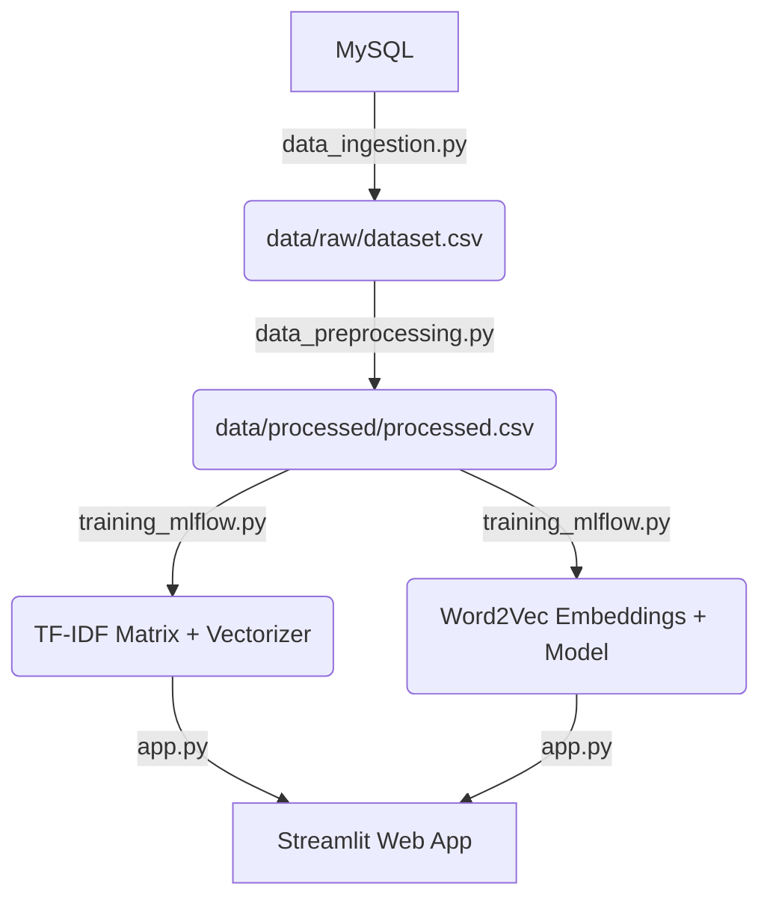

# 🛍️ Modern Hybrid Product Recommender

This is a production-grade Product Recommendation System built with a **Hybrid Intelligence** approach. It combines **TF-IDF Keyword Matching** with **Word2Vec Semantic Learning** to deliver accurate and relevant results for variety-heavy datasets (like fashion/e-commerce).

## 🚀 Key Features

*   **Hybrid Vectorization**: Uses TF-IDF for exact brand and name matching, and Word2Vec to understand relationships between similar categories (e.g., *chudi* and *kurti*).
*   **Dynamic Similarity Balancing**: Built-in UI slider lets users balance between keyword precision and semantic breadth.
*   **Highly Optimized**: Replaced heavy precomputed matrices (800MB) with lean, fast embedding matrices (~10MB total).
*   **DVC & MLflow Integration**: Fully versioned data pipelines and experiment tracking.
*   **Modern UI**: Beautiful Streamlit interface with responsive image rendering and weighting controls.

## 🏗️ Technical Architecture



## 🛠️ Setup & Usage

### 1. Activate Environment
```cmd
conda activate ./venv
```

### 2. Generate Model Artifacts
Prepare the data and train the hybrid models:
```cmd
python src\data_preprocessing.py
python src\training_mlflow.py
```

### 3. Run the App
Launch the modern recommendation interface:
```cmd
streamlit run src\app.py
```

## 📊 Evaluation (MLflow)
Track experiments and model parameters:
```cmd
mlflow ui
```

## 🛡️ License
MIT License
